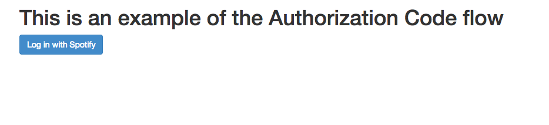
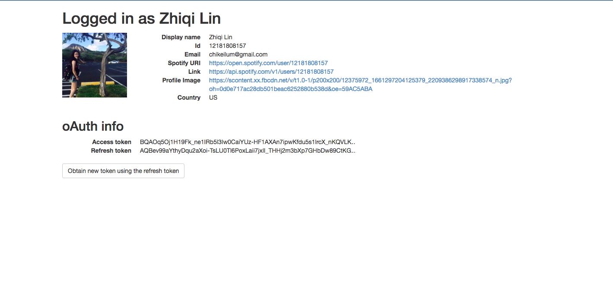

# Get user's information
ZK: 

* I tried to look up how to let the users log in.
* It requires a `Client ID`, `Client Secret` and our own `website's url`(when we have one) by signing up on [**Spotify Developer Application**](https://developer.spotify.com/my-applications/#!/)
(I deleted mine from the sample b/c security concern(otherwise everyone in git hub would know our client id and secret))
* In this sample, I can only get information of users':
	* Email
	* id
	* Spotify URI
	* Link
	* Profile Image
	* Country

My test result(use my account)

The first page 

Page After login my account

[here is the link for instruction of setting up](https://developer.spotify.com/web-api/tutorial/)

----------
# Here is the original instruction of the sample

## Spotify Accounts Authentication Examples

This project contains basic demos showing the different OAuth 2.0 flows for [authenticating against the Spotify Web API](https://developer.spotify.com/web-api/authorization-guide/).

These examples cover:

* Authorization Code flow
* Client Credentials flow
* Implicit Grant flow

## Installation

These examples run on Node.js. On [its website](http://www.nodejs.org/download/) you can find instructions on how to install it. You can also follow [this gist](https://gist.github.com/isaacs/579814) for a quick and easy way to install Node.js and npm.

Once installed, clone the repository and install its dependencies running:

    $ npm install

## Running the examples
In order to run the different examples, open the folder with the name of the flow you want to try out, and run its `app.js` file. For instance, to run the Authorization Code example do:

    $ cd authorization_code
    $ node app.js

Then, open `http://localhost:8888` in a browser.

### Using your own credentials
The examples contains a working client ID and secret key. Note, however, that they might be rate limited if they are used frequently. If you are planning to create an application, we recommend you register your app and get your own credentials instead of using the ones in this project.

Go to [My Applications on Spotify Developer](https://developer.spotify.com/my-applications) and create your application. For the examples, we registered these Redirect URIs:

* http://localhost:8888 (needed for the implicit grant flow)
* http://localhost:8888/callback

Once you have created your app, replace the `client_id`, `redirect_uri` and `client_secret` in the examples with the ones you get from My Applications.
